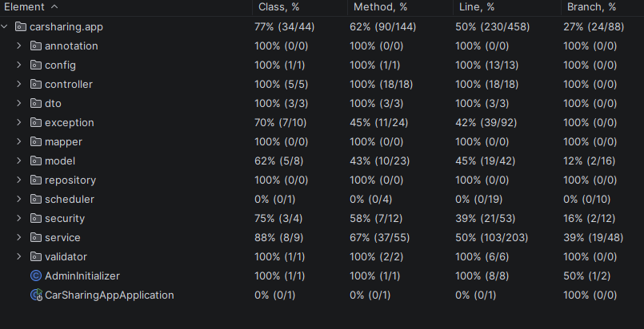
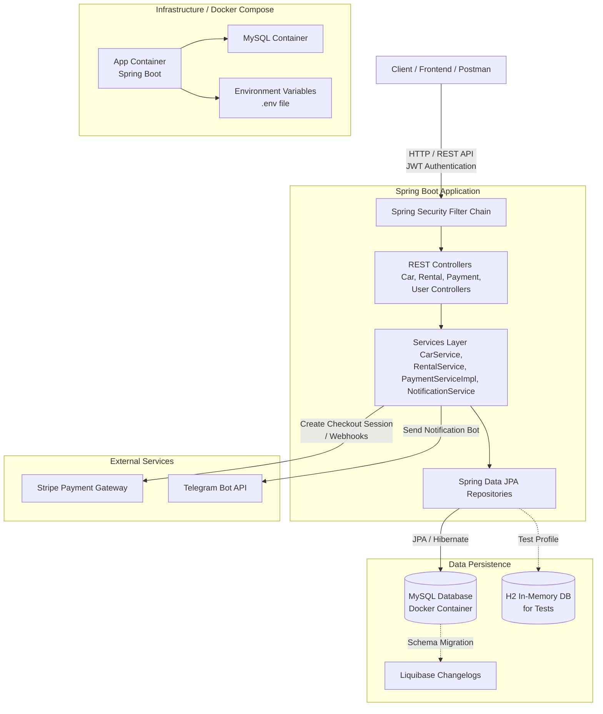
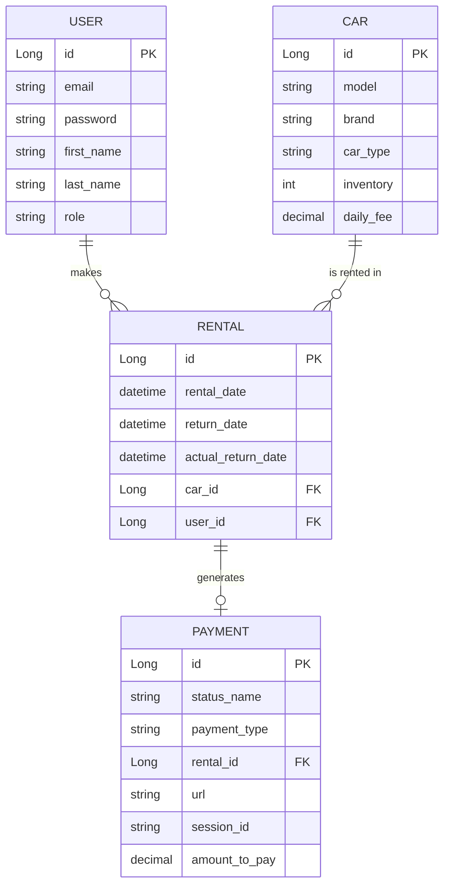
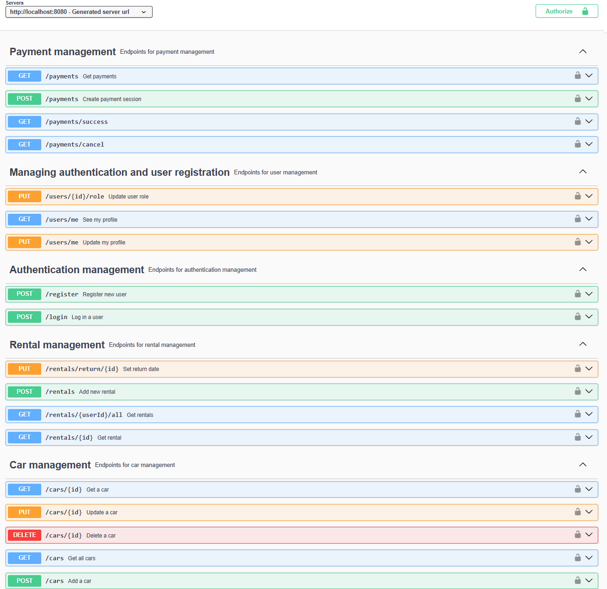

# CAR SHARING REST API

## Description

This application is a backend implementation of an e-commerce car sharing, designed with a focus on security and clean architecture.

## Features:
* Authentication & Authorization: The app uses tokens (JWT) to secure endpoints. It is designed with two roles: 'MANAGER' and 'CUSTOMER'. Each user is able to rent a car or see inventory of the shop.
* Stripe and telegram bot:
    * Stripe for payment methods. User can pay, cancel or see payments
    * Telegram bot is sending messages to everyone who is on the group chat about new rent or successfull payment,
    * Telegram bot is also sending notifications at 9.00 AM if rentals are overdue today or which user is late with returning a car or his payment.
* Manager & Customer capabilities:
    * Manager can:
        * Add, update, and delete cars,
        * Check all rentals by someones ID or without ID,
        * Set actuall return date of a rent,
        * Update user's role
    * Customer can:
        * Check cars or find car by ID,
        * Create stripe session or see all the payments
        * Create new rental or see rentals which are active (paid) or not,
        * See and update his own profile
* Validation: The application checks input data (for example, correct email format or non-empty fields) to prevent bad requests.
* Global Exception Handling: Errors are handled globally and return clear JSON messages.
* Testing: The project includes unit tests for controllers, services and repositories.

## Test percentage:



## Getting Started

### Dependencies

* Java 17
* Maven 3.9.9
* MySQL Database
* OS: Windows, macOS, Linux

### Technologies

* Spring Boot
* Spring Security
* JWT
* Spring Data JPA
* Hibernate
* Liquibase
* MapStruct
* Swagger / OpenAPI
* Docker
* JUnit 5
* Mockito
* Stripe API
* Telegram API

## Architecture
* Application architecture diagram: 



* Database relationship diagram: 



### Functionality

* AuthenticationController - registration and login,
    - Permissions free
* CarController - CRUD operations, pagination and search,
    - Requires 'MANAGER' to create, delete or update a car,
    - Permission free to get a car or page of cars.
* PaymentController - payment management,
    - Requires 'MANAGER' or 'CUSTOMER' to create payment session or get payments
    - Verify payment or cancel payment are permission free.
* RentalController - rental management,
    - Requires 'MANAGER' or 'CUSTOMER' to create new rentals,
    - Requires 'MANAGER' or 'CUSTOMER' to get all rentals, can sort by actual return date.(If car is returned or not)
        - Requires 'MANAGER' to see all rentals by specific user id, customer can see only his own rentals.
    - Requires 'MANAGER' to get rental by ID,
    - Requires 'MANAGER' to set actual rental return date.
* UserController - user management,
    - Requires 'MANAGER' to update user role,
    - Requires 'MANAGER' or 'CUSTOMER' to see his own profile,
    - Requires 'MANAGER' or 'CUSTOMER' to edit his own profile.


### Installing

1. Clone the repository:
```bash
git clone https://github.com/PatrykWski/car-sharing-app.git
```
2. Download, install and create new database in MySQL Workbench application.
* Turn on the application,
* On the left site of the application you will see a plus button. Press it,
* Write down your connection name for example: car_sharing
* In parameters section press Store in Vault button and write down your which u gonna use in the project,
* Test connection and click the OK button
* Press two times on your new database connection
* On new window write down in the main page "CREATE DATABASE car_sharing;
* Above it you can see lightning - press it,
* Congratulations you made a new database. 

3. Configure your database in: src/main/resources/application.properties
```bash
spring.datasource.url=jdbc:mysql://mysql:3306/car_sharing?useSSL=false&serverTimezone=UTC
spring.datasource.username=root
spring.datasource.password=your_password   <-- here u have to write your password which you used when u was creating new database
```

4. Liquibase creates tables automatically - you don't have to create them in database.

5. Create .env file and configure it as u wish, example: 
* There is .exampleENV where u can find example .env file with test manager details to test manager endpoints.
```
JWT_SECRET=your_secret_jwt_key
STRIPE_SECRET_KEY=your_sk_key
STRIPE_URL=your_url_address
TELEGRAM_TOKEN=your_telegram_token
TELEGRAM_CHAT_ID=your_telegram_id
APP_MANAGER_PASSWORD=your_test_manager_password
APP_MANAGER_EMAIL=your_test_manager_email
DB_PASSWORD=your_db_password

MYSQLDB_USER=user
MYSQLDB_PASSWORD=12345
MYSQLDB_ROOT_PASSWORD=root_password
MYSQLDB_DATABASE=application_db_name
MYSQLDB_LOCAL_PORT=3308
MYSQLDB_DOCKER_PORT=3306
SPRING_LOCAL_PORT=8080
SPRING_DOCKER_PORT=8080
DEBUG_PORT=5005

```
6. To run the application with docker write down in the console: 
* Before you do anything test the application: 
```
mvn clean test
```
* Turn on docker application:
```
docker compose up --build
```
* Turn off docker application: 
```
docker compose down
```
### Executing program

* Run the application via Maven:
```
mvn clean spring-boot:run
```
* Open Swagger UI to test the API:


```
http://localhost:8080/swagger-ui/index.html
```
1. Create a new user in registration endpoint.
2. Log in and remember to copy and save (!) your token otherwise you can not use other endpoints in the app.
3. Choose one of the endpoints for role 'CUSTOMER', press authorize button, pase your token and try out the endpoint.
4. U can always use test manager which login and password u can edit in .mvn file:
```
APP_MANAGER_PASSWORD=your_test_manager_password
APP_MANAGER_EMAIL=your_test_manager_email
```

## Postman
* Download and install postman application on your system,
* Turn on the application
* Above 'My collection' session u can see a square with an arrow - press it and choose 'import'
* Open your browser and write down : http://localhost:8080/v3/api-docs
* Copy json format and paste it in import section. 

### How to use postman
```
register -> login -> authorized request
```

1. On the left site of the application you can see a tree with all the endpoints from the car-sharing project,
2. Choose one of them and in authorization section choose Baerer token - on the right site you can paste your tokens,
3. After you paste your token go to Body section and write down details you need in the endpoint. 

## Help

Common problems or issues:
403 Forbidden in tests or requests: Make sure you are passing a valid JWT token or configured security context in your requests. In @WebMvcTest, handling Spring Security stateless filters can be tricky—ensure your authentication tokens are properly mocked.

Database connection error: Verify that your MySQL server is running and that the username and password in application.properties match your local setup.

## Challenges

Testing payment service was the biggest challenge - it has external API, payment and other small methods in one class which make it hard to test it.

## Authors

* @PatrykWski

## Version History

* 0.1
    * Initial Release - Added User Authentication, Car Catalog, Rental service, payment methods features with full testing suite.

## License

This project is licensed under the MIT License.

## Acknowledgments
* [awesome-readme](https://github.com/matiassingers/awesome-readme)
* [PurpleBooth](https://gist.github.com/PurpleBooth/109311bb0361f32d87a2)